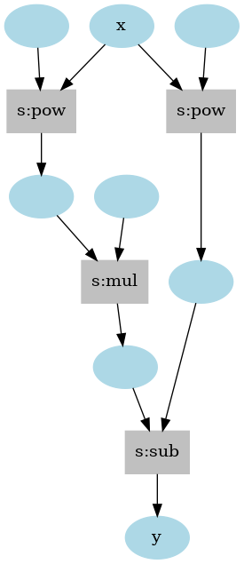

# vim-autograd
**Automatic differentiation library written in pure Vim script.**

[](https://github.com/pit-ray/vim-autograd/actions/workflows/test.yml)  

vim-autograd provides a foundation for automatic differentiation through the Define-by-Run style algorithm such as Chainer or PyTorch. Since it is written completely in pure Vim script, there are no dependencies.

This library allows us to create next-generation plugins with numerical computation of multidimensional arrays or deep learning using the gradient descent method.


## Installation
If you are using [vim-plug](https://github.com/junegunn/vim-plug), can install as follows.

```vim
Plug 'pit-ray/vim-autograd'
```

## Usage

A computational graph is constructed by applying the provided differentiable functions to a Tensor object, and the gradient is calculated by backpropagating from the output.

```vim
function! s:f(x) abort
  " y = x^5 - 2x^3
  let y = autograd#sub(a:x.p(5), a:x.p(3).m(2))
  return y
endfunction

function! s:example() abort
  let x = autograd#tensor(2.0)
  let y = s:f(x)

  call y.backward()
  echo x.grad.data
endfunction

call s:example()
```

**Output**
```
[56.0]
```

The computational graph is automatically generated like the below.



## Examples
- [Basic differentiation and computational graph visualization](examples/README.md#simplest-differentiation)
- [Higher-order differentiation using double-backprop](examples/README.md#higher-order-differentiation)
- [Classification using deep learning](examples/README.md#classification-using-deep-learning)

## Related posts
- https://zenn.dev/pitray/articles/482e89ddff329c

## References
- [oreilly-japan/deep-learning-from-scratch-3](https://github.com/oreilly-japan/deep-learning-from-scratch-3)
- [chainer/chainer](https://github.com/chainer/chainer)
- [pytorch/pytorch](https://github.com/pytorch/pytorch)
- [numpy/numpy](https://github.com/numpy/numpy)
- [mattn/vim-brain](https://github.com/mattn/vim-brain)

## License
This library is provided by **MIT License**.

## Author
- pit-ray
