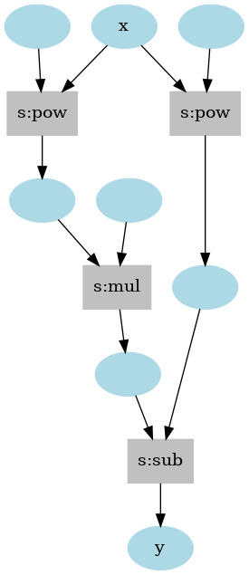
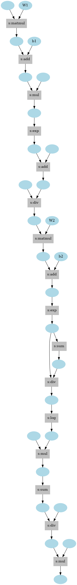

# vim-autograd Examples
Here are some examples of using vim-autograd. Each example can be run like `:source examples/*.vim` in Vim with vim-autograd installed.

## Simplest Differentiation
In this example, do define-by-run style automatic differentiation using a PyTorch-like interface.

First, apply differentiable operations on Tensor objects generated by the `autograd.Tensor.new()` function with functions or methods. Then, when the backward method is called starting from the output Tensor object, the gradient is computed by backward propagation following the computational graph generated during forward propagation in the reverse direction. Finally, the gradient propagated from the output is accumulated in the `.grad` attribute of the input Tensor object.

[**examples/basic.vim**](basic.vim)  
```vim
vim9script

import '../autoload/autograd.vim' as ag
const Tensor = ag.Tensor

def F(x: Tensor): Tensor
  # y = x^5 - 2x^3
  var y = ag.Sub(
    ag.Pow(x, 5),
    ag.Mul(2, ag.Pow(x, 3)))
  return y
enddef

def Main()
  var x = Tensor.new(2.0)

  var y = F(x)
  ag.Backward(y)

  var x_grad: Tensor = x.grad
  echo x_grad.data

  x.SetName('x')
  y.SetName('y')
  ag.DumpGraph(y, '.autograd/example1.png')
enddef

Main()
```

**Output**
```vim
[56.0]
```

**Generated computational graph**  


To output a graph as an image file, [**graphviz**](https://graphviz.org/) must be installed. On Ubuntu, this can be done with the following command.
```sh
$ sudo apt install graphviz
```
If not installed, only the DOT language source code is generated.

## Higher-order Differentiation
Because vim-autograd supports double-backprop feature, you can do higher-order differentiation by further differentiating the first-order derivative.  

`autograd.Backward()` and `autograd.Grad()` are available for differentiation. The former requires resetting the gradient as it accumulates in the input variable in higher-order differentiation, while the latter does not pollute the gradient of the input variable. The following code does almost the same thing.  

**autograd.Backward()**
```vim
var y = F(x)
autograd.Backward(y, true)
var gx1: autograd.Tensor = x.grad

x.ClearGrad()
autograd.Backward(gx1)
var gx2: autograd.Tensor = x.grad
```

**autograd.Grad()**
```vim
var y = F(x)
var gx1 = autograd.Grad(y, x, 1)
var gx2 = autograd.Grad(gx1, x, 1)
```

To enable double-backprop, the first argument of `autograd.Backward()` or the third argument of `autograd.Grad()` must be `true`.

The following is an example of finding the third-order derivative.

[**examples/higher-order.vim**](higher-order.vim)
```vim
vim9script
scriptencoding utf-8

import '../autoload/autograd.vim' as ag
const Tensor = ag.Tensor

def F(x: Tensor): Tensor
  # y = x^5 - 2x^3 + 4x^2 + 6x + 5
  var t1 = ag.Pow(x, 5)
  var t2 = ag.Mul(-2, ag.Pow(x, 3))
  var t3 = ag.Mul(4, ag.Pow(x, 2))
  var t4 = ag.Mul(6, x)
  var t5 = 5
  var y = ag.Add(t1, ag.Add(t2, ag.Add(t3, ag.Add(t4, t5))))
  return y
enddef

def Main()
  var x = Tensor.new(2.0)
  var y = F(x)
  echo 'y  :' y.data

  x.SetName('x')
  y.SetName('y')
  ag.DumpGraph(y, '.autograd/example2.png')

  # gx1 = 5x^4 - 6x^2 + 8x + 6
  var gx1: Tensor = ag.Grad(y, x, true)
  echo 'gx1:' gx1.data

  # gx2 = 20x^3 - 12x + 8
  var gx2: Tensor = ag.Grad(gx1, x, true)
  echo 'gx2:' gx2.data

  # gx3 = 60x^2 - 12
  ag.Backward(gx2, true)
  var gx3: Tensor = x.grad
  echo 'gx3:' gx3.data
enddef

Main()
```

**Output**
```vim
y  : [49.0]
gx1: [78.0]
gx2: [144.0]
gx3: [228.0]
```

## Classification using Deep Learning
Since vim-autograd can find the gradient, it is possible to use the gradient descent method for deep learning.  
Here we use the [wine classification dataset](https://archive.ics.uci.edu/ml/datasets/Wine), a public toy dataset provided by UCI, to classify three types of wine from a 13-dimensional vector.  

### Preprocess Dataset
First, we standardize this data set and divide into training set and test set.

[**examples/wine-classify.vim**](wine-classify.vim)
```vim
def GetWineDataset(filename: string): list<list<list<float>>>
  # This refers to the following public toy dataset.
  # http//archive.ics.uci.edu/ml/datasets/Wine
  var dataset = map(
    readfile(filename),
    (_, line) => map(
      split(line, ','),
      (_, v) => str2float(v)))

  var N = len(dataset)

  # average
  var means = repeat([0.0], 14)
  for data in dataset
    for i in range(1, 13)
      means[i] += data[i]
    endfor
  endfor
  map(means, (_, v) => v / N)

  # standard deviation
  var stds = repeat([0.0], 14)
  for data in dataset
    for i in range(1, 13)
      stds[i] += pow(data[i] - means[i], 2)
    endfor
  endfor
  map(stds, (_, v) => sqrt(v / N))

  # standardization
  for data in dataset
    for i in range(1, 13)
      data[i] = (data[i] - means[i]) / stds[i]
    endfor
  endfor

  # split the dataset into train and test.
  var train_x: list<list<float>>
  var train_t: list<list<float>>
  var test_x: list<list<float>>
  var test_t: list<list<float>>
  var test_num_per_class = 10
  for i in range(3)
    var class_split = ag.Shuffle(
      filter(deepcopy(dataset), (_, v) => v[0] == i + 1))

    var train_split = class_split[: -test_num_per_class - 1]
    var test_split = class_split[-test_num_per_class :]

    train_x += mapnew(train_split, (_, vs) => vs[1 :])
    train_t += mapnew(train_split, (_, vs) => map(vs[: 0], (_, v) => v - 1))
    test_x += mapnew(test_split, (_, vs) => vs[1 :])
    test_t += mapnew(test_split, (_, vs) => map(vs[: 0], (_, v) => v - 1))
  endfor

  return [train_x, train_t, test_x, test_t]
enddef
```

### Build Neural Network
A multi-layer network is then constructed using fully connected layers. However, we need to use the differentiable functions provided by vim-autograd.

[**examples/wine-classify.vim**](wine-classify.vim)
```vim
interface HasModule
  def Parameters(): list<Tensor>
  def Forward(...inputs: list<any>): Tensor
endinterface


class Linear implements HasModule
  public this.weight: Tensor
  public this.bias: Tensor

  def new(in_channels: number, out_channels: number)
    var std = sqrt(2.0 / in_channels)
    this.weight = ag.Normal(0.0, std, [in_channels, out_channels])
    this.weight.SetName('weight')

    this.bias = ag.Zeros([out_channels])
    this.bias.SetName('bias')
  enddef

  def Parameters(): list<Tensor>
    return [this.weight, this.bias]
  enddef

  def Forward(...inputs: list<any>): Tensor
    var t = ag.Add(ag.Matmul(inputs[0], this.weight), this.bias)
    return t
  enddef
endclass


def ReLU(x: any): Tensor
  return ag.Maximum(x, 0.0)
enddef


def Softmax(x: any): Tensor
  var y: Tensor = ag.Exp(ag.Sub(x, ag.Max(x)))
  var sx = ag.Sum(y, 1, true)
  return ag.Div(y, sx)
enddef


def CrossEntropyLoss(y: any, t: any): Tensor
  var loss: Tensor = ag.Mul(t, ag.Log(y))
  var batch_size = loss.shape[0]
  return ag.Div(ag.Sum(loss), -1 * batch_size)
enddef


class MLP implements HasModule
  this.l1: HasModule
  this.l2: HasModule

  def new(in_size: number, classes: number, hidden_size: number = 100)
    this.l1 = Linear.new(in_size, hidden_size)
    this.l2 = Linear.new(hidden_size, classes)
  enddef

  def Parameters(): list<Tensor>
    var params: list<Tensor>
    params += this.l1.Parameters()
    params += this.l2.Parameters()
    return params
  enddef

  def Forward(...inputs: list<any>): Tensor
    var h = ReLU(this.l1.Forward(inputs[0]))
    h = Softmax(this.l2.Forward(h))
    return h
  enddef
endclass
```

### Prepare Optimizer
SGD with momentum, weight decay, and gradient clipping can be implemented as follows.

[**examples/wine-classify.vim**](wine-classify.vim)
```vim
abstract class Optimizer
  this.params: list<Tensor>

  def OneUpdate(param: Tensor): Tensor
  enddef

  def Step()
    map(this.params, (_, v): Tensor => this.OneUpdate(v))
  enddef

  def ZeroGrad()
    for param in this.params
      param.grad = ag.ZerosLike(param)
    endfor
  enddef
endclass


class SGD extends Optimizer
  this.lr: float
  this.momentum: float
  this.weight_decay: float
  this.vs: dict<Tensor>

  def new(
      params: list<Tensor>,
      lr: float = 0.01,
      momentum: float = 0.9,
      weight_decay: float = 0.0)
    this.params = params
    this.lr = lr
    this.momentum = momentum
    this.weight_decay = weight_decay
  enddef

  def OneUpdate(param: Tensor): Tensor
    if this.weight_decay > 0
      ag.Elementwise(
        [param.grad, param],
        (g, p): float => g + this.weight_decay * p,
        param.grad)
    endif

    if this.momentum == 0
      return ag.Elementwise(
        [param, param.grad], (p, g): float => p - g * this.lr, param)
    endif

    if !this.vs->has_key(param.id)
      this.vs[param.id] = ag.ZerosLike(param)
    endif

    var v: Tensor = this.vs[param.id]
    v = ag.Sub(ag.Mul(v, this.momentum), ag.Mul(this.lr, param.grad))
    this.vs[param.id] = v

    return ag.Elementwise([param, v], (x1, x2): float => x1 + x2, param)
  enddef
endclass
```

### Training

With the above basic layers and optimizers, the training can be described like a general deep learning framework (e.g. PyTorch, Chainer).

[**examples/wine-classify.vim**](wine-classify.vim)
```vim
def Main()
  ag.ManualSeed(42)

  var [train_x, train_t, test_x, test_t] = GetWineDataset('.autograd/wine.data')
  var ndim = 13
  var nclass = 3
  var model = MLP.new(ndim, nclass)
  var optim = SGD.new(model.Parameters(), 0.1, 0.9, 0.0001)

  # train
  var max_epoch: number = 14
  var batch_size: number = 16
  var train_data_num: number = len(train_x)
  var each_iteration: number = float2nr(ceil(1.0 * train_data_num / batch_size))

  var logs: list<string>
  for epoch in range(max_epoch)
    var indices = ag.Shuffle(range(train_data_num))
    var epoch_loss: float = 0.0
    for i in range(each_iteration)
      var x: list<list<float>>
      var t: list<list<float>>
      for index in indices[i * batch_size : (i + 1) * batch_size - 1]
        x->add(train_x[index])

        var onehot = repeat([0.0], nclass)
        onehot[float2nr(train_t[index][0])] = 1.0
        t->add(onehot)
      endfor

      var y = model.Forward(x)
      var loss = CrossEntropyLoss(y, t)
      # ag.DumpGraph(loss, '.autograd/loss.png')

      optim.ZeroGrad()
      ag.Backward(loss)
      optim.Step()

      epoch_loss += loss.data[0]
    endfor

    epoch_loss /= each_iteration

    # logging
    logs->add(epoch .. ', ' .. epoch_loss)
    logs->writefile('.autograd/train.log')
  endfor

  var Argmax = (pred: Tensor): number => {
    var pred_max: Tensor = ag.Max(pred)
    return pred.data->index(pred_max.data[0])
  }

  # evaluate
  ag.NoGrad(() => {
    var accuracy: float = 0.0
    var elapsed_time: float = 0.0

    for i in range(len(test_x))
      var start = reltime()
      var pred = model.Forward([test_x[i]])
      elapsed_time += reltimefloat(reltime(start))

      if Argmax(pred) == float2nr(test_t[i][0])
        accuracy += 1.0
      endif
    endfor

    accuracy /= len(test_t)
    elapsed_time /= len(test_t)

    echomsg 'accuracy: ' .. accuracy * 100 .. '(%)'
    echomsg 'processing time: ' .. elapsed_time * 1000 .. '(ms)'
  })

enddef
```

When `Main()` is executed, the loss is reduced as follows, and training is completed in a few minutes.
```csv
0, 0.379945
1, 0.094833
2, 0.029978
3, 0.002876
4, 0.027007
5, 0.065495
6, 0.020479
7, 0.01342
8, 0.046886
9, 0.042945
...
```

**Output**
```
accuracy: 96.666667 (%)
processing time: 1.990123 (ms)
training time: 13.952292 (s)
```

The computational graph generated is shown below.  

